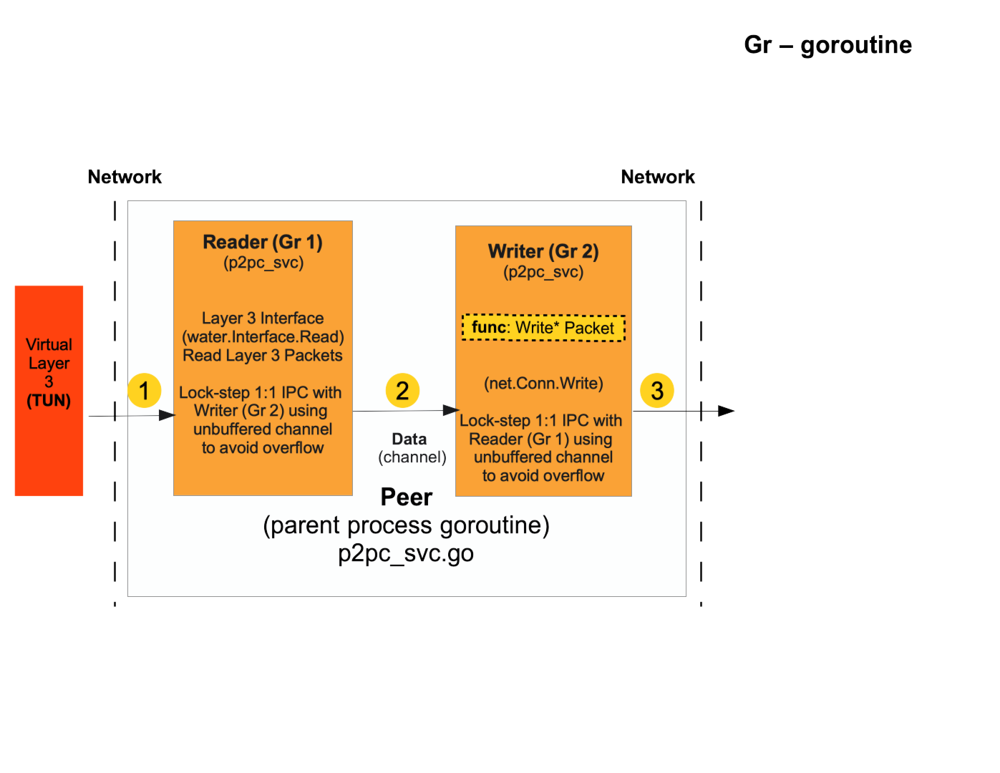

# Go P2P TUN/TAP Tunneling Service

## P2P Tunnel Service
p2p_tunelsvc is P2P/UDP peer-to-peer server pair that receives TUN packets and send TUN packets (along with any enclosed private data in the header)
and a receiver peer that receives the TUN packets (reads/writes to the packet and resends the TUN packet out again on TUN device layer (virtual Layer 3).
